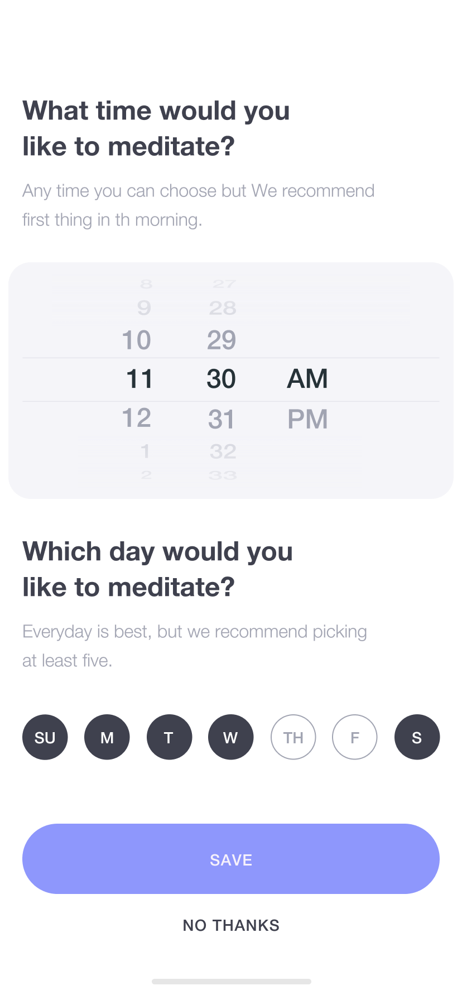
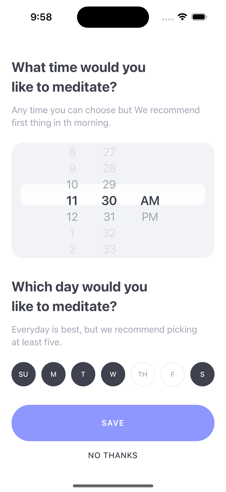
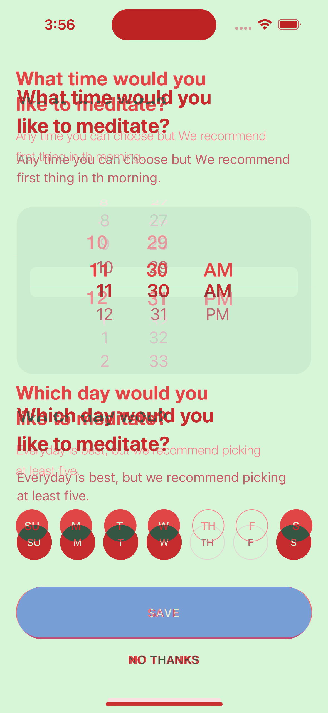
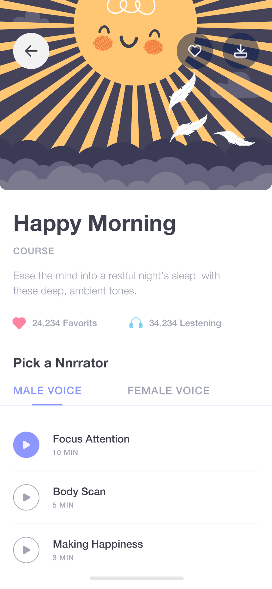
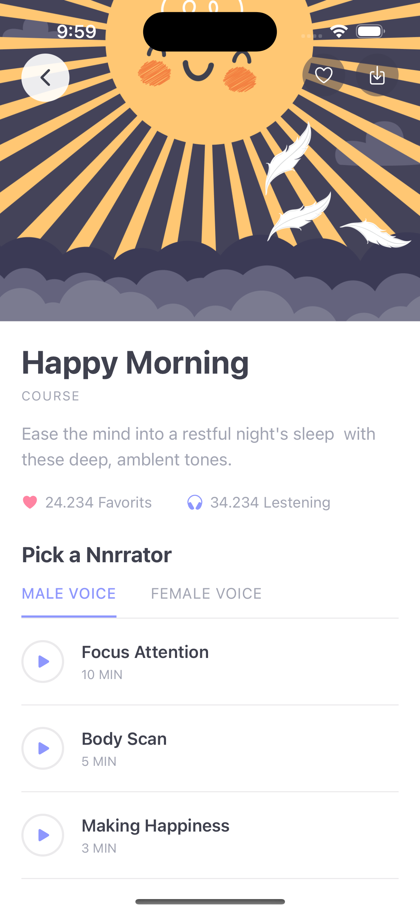
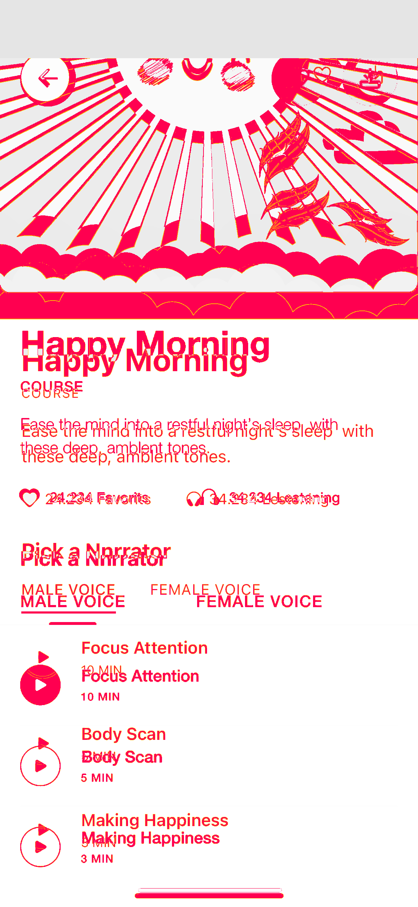
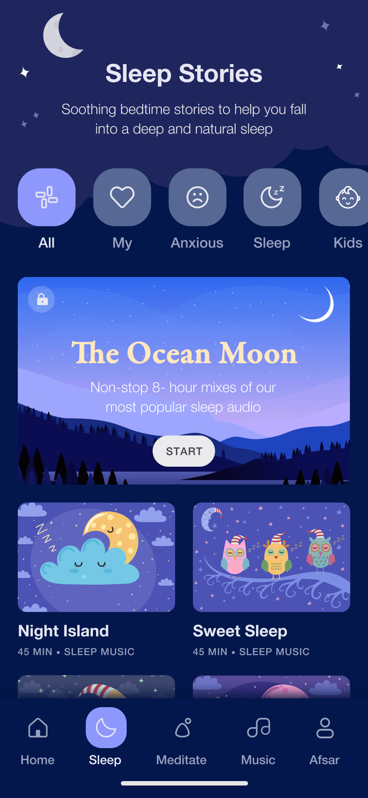
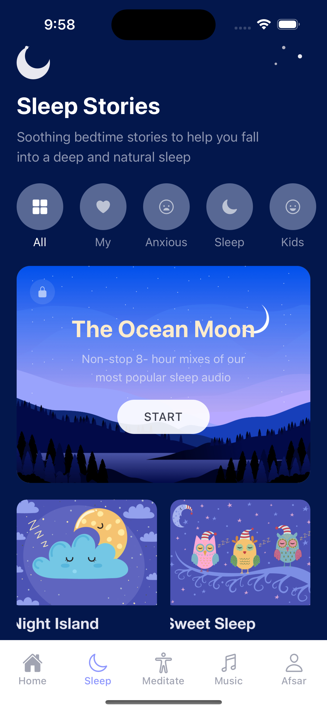
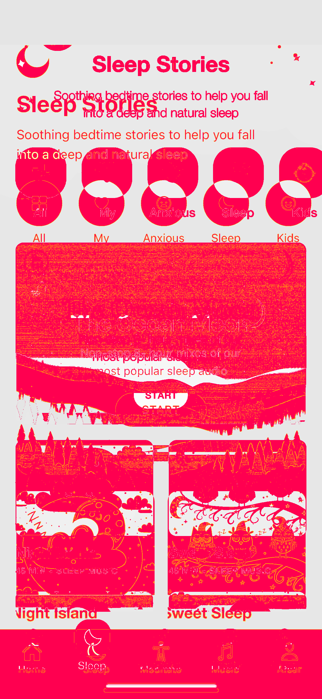

# Figma Design Checker

> Part of [Mobile DevTools](https://github.com/RevylAI/mobile-devtools) — open-source tools for mobile engineering teams.

**Verify your app matches the design.** Pull frames from Figma, screenshot the real app on a cloud device, pixel-diff them. Catch design drift before it ships.

---

## Example: Figma vs App vs Diff

Here's what the checker produces — comparing Figma designs against a real app running on a Revyl cloud device:

| Figma Frame | App Screenshot | Diff Overlay |
|:-----------:|:--------------:|:------------:|
|  |  |  |
| Reminders — 92.2% (B) | | |
|  |  |  |
| Course Details — 84.6% (C) | | |
|  |  |  |
| Sleep — 46.5% (F) | | |

Red highlights where the implementation diverges from the design. Each screen gets a fidelity score and letter grade.

> **[View the full HTML report](https://revylai.github.io/figma-design-checker/)** with all 9 screens compared side-by-side.

---

## How It Works

```
Figma File                Revyl Cloud Device            Report
   |                           |                          |
   |  1. Export frames         |  2. Boot device          |
   |  as PNGs via API    -->   |  Navigate screens  -->   |  3. Pixel-diff
   |                           |  Screenshot each         |  Generate scores
   |                           |                          |  HTML + Markdown
   v                           v                          v
figma_export/             app_screenshots/             report/
   home.png                   home.png                   report.html
   sign_up.png                sign_up.png                report.md
   sleep.png                  sleep.png                  diffs/
```

Each screen gets a fidelity score measuring how closely the implementation matches the design. Differences are highlighted in a visual overlay: green where the app matches the Figma frame, red where it diverges.

## Quick Start

### Prerequisites

- Python 3.10+
- [Revyl CLI](https://docs.revyl.ai) installed and authenticated
- A Figma personal access token ([generate one here](https://www.figma.com/developers/api#access-tokens))
- An app build uploaded to Revyl

### Install

```bash
git clone https://github.com/RevylAI/figma-design-checker.git
cd figma-design-checker
pip install -r requirements.txt
```

### Run

```bash
# 1. Export Figma frames
python scripts/fetch_figma.py \
  --file-key YOUR_FIGMA_FILE_KEY \
  --token $FIGMA_ACCESS_TOKEN \
  --output-dir figma_frames \
  --scale 2

# 2. Capture app screenshots on a cloud device
python scripts/capture.py \
  --platform android \
  --app-id $REVYL_APP_ID \
  --output-dir app_screenshots \
  --screens screens.yaml

# 3. Generate the compliance report
python scripts/diff.py \
  --figma-dir figma_frames \
  --app-dir app_screenshots \
  --output-dir report
```

Open `report/report.html` in a browser to see the results.

## Example Output

```
Engine:  pixelmatch (anti-aliasing aware, YIQ)
Masking: status bar masked (ios)

Comparing 9 screen(s) ...

  Reminders        92.2% [B]  ✅
  Course Details   84.6% [C]
  Sign Up          82.2% [C]
  Sign Up & Sign In 78.9% [D]
  Welcome          76.3% [D]
  Home             74.1% [D]
  Meditate V2      65.1% [F]
  Choose Topic     57.4% [F]
  Sleep            54.0% [F]

============================================================
  Overall Fidelity:  73.9%
  Grade:             D
============================================================
```

### Compliance Grades

| Grade | Score | Meaning |
|-------|-------|---------|
| **A** | 95%+  | Matches the design |
| **B** | 90-95% | Minor deviations |
| **C** | 80-90% | Review recommended |
| **D** | 70-80% | Significant drift |
| **F** | < 70% | Needs rework |

## Figma Setup

### Getting Your Access Token

1. Open [Figma Account Settings](https://www.figma.com/settings)
2. Scroll to **Personal access tokens**
3. Click **Generate new token**, name it, and copy the value
4. Export it: `export FIGMA_ACCESS_TOKEN=fig_...`

### Finding Your File Key

The file key is in the Figma URL:

```
https://www.figma.com/file/aBcDeFgHiJkLmN/My-Design
                              ^^^^^^^^^^^^^^
                              This is the file key
```

You can pass the full URL or just the key to `--file-key`.

### Frame Naming Convention

The checker matches Figma frames to app screenshots by name. Name your top-level frames descriptively:

```
Shop - Home
Product - Detail
Search
Cart - Empty
Cart - With Items
Profile
```

Then update `screens.yaml` to map each frame name to the navigation steps needed to reach that screen in the app.

## Customization

### Using With Your Own App

1. **Upload your build to Revyl:**
   ```bash
   revyl app create --name "MyApp" --platform android --json
   revyl build upload --skip-build --platform android --app "$APP_ID" --file app.apk --json --yes
   ```

2. **Edit `screens.yaml`** to map your Figma frame names to navigation steps:
   ```yaml
   screens:
     - figma_frame: "Login Screen"
       app_screen: "login"
       description: "Login page with email and password fields"
       steps: []

     - figma_frame: "Dashboard"
       app_screen: "dashboard"
       steps:
         - action: type
           target: "Email"
           text: "test@example.com"
         - action: type
           target: "Password"
           text: "password123"
         - action: tap
           target: "Sign In"
       reset: true
   ```

3. **Run the workflow** as shown above.

### Adjusting Sensitivity

The `--threshold` flag on `diff.py` controls how strict the comparison is:

- `0.02` — Very strict, catches subtle color shifts
- `0.05` — Default, good balance for most apps
- `0.10` — Lenient, useful if your app has dynamic content (timestamps, avatars)

### Filtering Specific Frames

Export only the frames you care about:

```bash
python scripts/fetch_figma.py \
  --file-key $KEY \
  --token $TOKEN \
  --frame-filter "Shop - Home" "Product - Detail"
```

## CI/CD Integration

A GitHub Actions workflow is included at `.github/workflows/design-check.yml`. It can:

- Run on every PR to catch design regressions
- Run manually with a Figma file key input
- Post the compliance report as a PR comment or job summary

Set these secrets in your repository:
- `FIGMA_ACCESS_TOKEN`
- `REVYL_API_KEY`
- `REVYL_APP_ID`

## Built With

- **[Revyl CLI](https://docs.revyl.ai)** — Cloud device provisioning and AI-grounded mobile interaction
- **[Figma API](https://www.figma.com/developers/api)** — Design frame export
- **[pixelmatch](https://github.com/nicgirault/pixelmatch-py)** — Anti-aliasing aware pixel diff (same engine as Playwright/Storybook)
- **[Pillow](https://pillow.readthedocs.io/)** — Image processing (fallback diff)
- **[Claude Code Action](https://docs.anthropic.com)** — Automated agent execution in CI

## License

MIT
